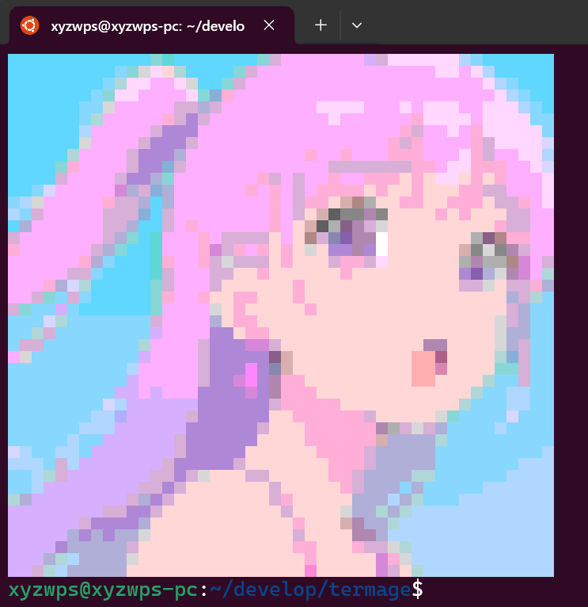

Termage
========

Display images in Console/Terminal.

```js
import draw from 'termage'

await draw("example.png")
  .then(() => process.exit(0))
  .catch((err) => {
    console.error("Error drawing image:", err);
    process.exit(1);
  });
```

<div align="center">
	
</div>
